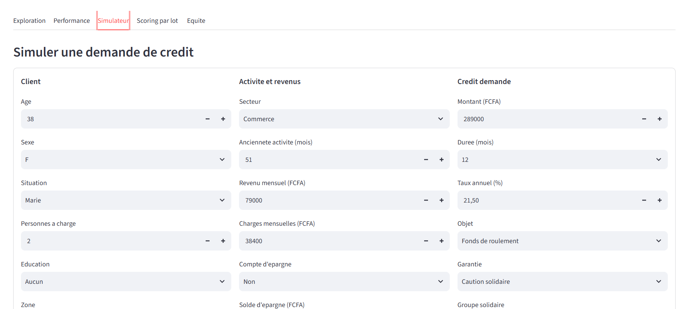

# Scoring de crédit en microfinance

Modèle de prédiction du défaut de paiement pour une institution de microfinance,
livré avec un tableau de bord Streamlit utilisable par un agent de crédit.

**TP 1 , classification binaire déséquilibrée · finance inclusive**

---

## 1. Le problème

Une institution de microfinance accorde des crédits à des commerçants, artisans et
producteurs agricoles. Elle dispose de l'historique de **9 255 dossiers** octroyés entre
2021 et 2025, avec pour chacun l'issue du remboursement.

**Objectif :** estimer, **au moment de la demande**, la probabilité qu'un dossier finisse
en défaut de paiement , et rendre cette estimation exploitable en agence.

Le taux de défaut observé est de **15,5 %**. Les classes sont déséquilibrées :
l'*accuracy* est écartée d'emblée (un modèle qui accepte tout le monde obtient 84,5 %
d'accuracy et zéro utilité). Les métriques retenues sont la **PR AUC**, le **rappel** et
un **coût métier** explicite.

> Les données sont **synthétiques**. Les relations qu'elles contiennent sont réalistes
> mais aucune conclusion réelle ne doit en être tirée.

---

## 2. Les données

`data/credits_microfinance.csv` , 9 255 lignes × 29 colonnes, montants en francs CFA.

| Bloc | Colonnes |
|---|---|
| Identifiants | `id_client`, `date_octroi` |
| Profil client | `age`, `sexe`, `situation_matrimoniale`, `nb_personnes_charge`, `niveau_education`, `zone_habitation` |
| Activité et revenus | `secteur_activite`, `anciennete_activite_mois`, `revenu_mensuel_fcfa`, `charges_mensuelles_fcfa`, `possede_compte_epargne`, `montant_epargne_fcfa` |
| Crédit | `montant_credit_fcfa`, `duree_credit_mois`, `taux_interet_annuel`, `objet_credit`, `type_garantie`, `membre_groupe_solidaire` |
| Historique et empreinte numérique | `nb_credits_anterieurs`, `nb_retards_anterieurs`, `score_mobile_money`, `nb_transactions_mm_mois`, `distance_agence_km`, `agent_credit` |
|  Post-décision (fuite) | `nb_relances_recouvrement`, `statut_dossier` |
|  Cible | `defaut_paiement` (1 = défaut, 15,5 %) |

### Anomalies identifiées et traitées

| Anomalie | Volume                     | Traitement                                |
|---|----------------------------|-------------------------------------------|
| Doublons exacts | **55** (et non 52)         | Suppression après normalisation des dates |
| Sentinelles `age = -1` | 95                         | => `NaN`                                  |
| Sentinelles `revenu = -999` | 70                         | => `NaN`                                  |
| Sentinelles `distance = 9999` | 45                         | => `NaN`                                  |
| Erreurs d'unité sur le revenu (×1000) | 30                         | Division par 1000                         |
| Modalités catégorielles fantômes | 43 => 30                   | `strip` + `capitalize` + synonymes        |
| Formats de date mélangés | 300 lignes en `JJ/MM/AAAA` | `format="mixed", dayfirst=True`           |
| Valeurs manquantes | 6 colonnes, 1,5 % à 12,8 % | Imputation **dans le pipeline**           |

**Trois trouvailles qui ne figuraient pas dans l'énoncé :**

1. **55 doublons et non 52.** Trois paires (`CLI-003114`, `CLI-003679`, `CLI-008258`)
   diffèrent uniquement sur `date_octroi`, écrite dans les deux formats
   (`18/10/2024` vs `2024-10-18` , la même date). `duplicated()` comparant des chaînes de
   caractères, il ne pouvait pas les voir. **La normalisation des formats doit précéder
   la détection des doublons**, contrairement à l'ordre de l'énoncé.

2. **Les valeurs manquantes sont MCAR, pas MAR.** ~96 tests d'indépendance
   (χ² sur les catégorielles, Mann-Whitney sur les numériques) ont été menés. Cinq
   ressortent significatifs au seuil brut de 5 % , soit exactement le nombre de faux
   positifs attendus par le hasard , et **aucun ne survit à la correction de Bonferroni**.
   Les clients sans score mobile money ne sont ni plus ruraux (34,0 % contre 32,7 %),
   ni moins éduqués, ni plus pauvres.

3. **`montant_epargne_fcfa` vaut 0 sur 5 286 lignes sans exception** quand
   `possede_compte_epargne == 0`. La valeur manquante est donc *déductible*, pas à estimer.

---

## 3. Démarche

### La fuite de données

Deux colonnes ne sont connues **qu'après** le défaut :

- `nb_relances_recouvrement` , les relances de recouvrement n'existent que si le client
  ne paie pas (corrélation de **0,88** avec la cible, quand aucune autre variable ne
  dépasse 0,20) ;
- `statut_dossier` , `Contentieux` / `Recouvrement` / `Restructure` correspondent à
  **100 %** de défauts, `Solde` / `En cours` à **0 %** : c'est la cible réécrite.

`statut_dossier` étant catégorielle, elle **n'apparaît pas dans une matrice de
corrélation** , il a fallu la croiser explicitement avec la cible pour la détecter.

**Expérience demandée** (`reports/experience_fuite.csv`) :

| Configuration | CV ROC AUC | Test ROC AUC | Test PR AUC |
|---|---|---|---|
| **AVEC** les colonnes post-décision | **1,0000** | **1,0000** | **1,0000** |
| **SANS** (modèle retenu) | 0,8491 | 0,8331 | 0,5095 |

Une AUC de 1,00 signale un modèle **parfait en apprentissage et inutilisable en
production** : ces informations n'existent pas au moment de la décision de crédit.

### Séparation temporelle

Tri par `date_octroi`, entraînement sur les 80 % les plus anciens
(2021-01-01 => 2024-05-28, 7 352 dossiers), test sur les 20 % les plus récents
(2024-05-29 => 2025-03-30, 1 848 dossiers).

La découpe se fait sur une **date seuil** (`<` / `>=`) et non sur un rang d'index :
9 dossiers partagent la date frontière et doivent rester du même côté , on ne dispose
jamais d'une demi-journée en production.

**Pourquoi un `train_test_split` aléatoire est optimiste**, mesuré sur ce jeu :

```
split ALÉATOIRE  AUC test = 0,8412
split TEMPOREL   AUC test = 0,8331     écart : +0,0081 d'illusion
```

Trois raisons : (1) il met des dossiers de 2025 dans l'entraînement et des dossiers de
2021 dans le test , impossible en réalité ; (2) il ne teste pas la robustesse à la
dérive des conditions d'octroi ; (3) il exploite les corrélations de voisinage temporel
(même agent, même campagne, même conjoncture).

### Ingénierie de variables

15 variables dérivées, dont les 6 obligatoires. La plus déterminante de très loin :

```
ratio_endettement = mensualite_estimee / capacite_remboursement
```

**Elle atteint à elle seule une AUC univariée de 0,825** , soit la performance du modèle
complet. La meilleure colonne brute (`duree_credit_mois`) plafonne à 0,68.

### Traitement du déséquilibre

`reports/comparaison_desequilibre.csv`, à modèle égal :

| Approche | CV ROC AUC | Test ROC AUC |
|---|---|---|
| Aucun traitement | 0,8484 ± 0,0126 | 0,8323 |
| **`class_weight="balanced"`** | **0,8491 ± 0,0128** | **0,8331** |
| Sous-échantillonnage | 0,8446 ± 0,0112 | 0,8309 |
| SMOTE | 0,8465 ± 0,0130 | 0,8286 |

Les quatre approches tiennent dans un écart-type. `class_weight="balanced"` est retenue :
elle gagne de justesse et ne coûte rien , ni données synthétiques, ni perte d'information.
Le rééchantillonnage passe par `imblearn.pipeline`, jamais celui de scikit-learn, pour
que SMOTE ne s'applique qu'aux blocs d'entraînement.

**Le vrai levier sur le déséquilibre n'est pas là : c'est le seuil de décision.**

---

## 4. Résultats

### Comparaison des modèles (`reports/comparaison_modeles.csv`)

| Modèle | CV ROC AUC (5 blocs) | Test ROC AUC | Test PR AUC |
|---|---|---|---|
| **Régression logistique** | **0,8491 ± 0,0128** | **0,8331** | **0,5095** |
| Forêt aléatoire | 0,8456 ± 0,0135 | 0,8144 | 0,4709 |
| HistGradientBoosting | 0,8375 ± 0,0163 | 0,8103 | 0,4894 |

Le modèle linéaire l'emporte, en validation croisée comme en test. Le signal dominant
(`ratio_endettement`) est **monotone** : un modèle linéaire le capte entièrement, et les
modèles à arbres n'ont presque rien de non linéaire à découvrir en plus. Leur écart-type
plus élevé (0,016 contre 0,013) traduit un sur-apprentissage du bruit.

Le réglage par `RandomizedSearchCV` (grille : `C` sur 20 valeurs logarithmiques,
`l1_ratio ∈ {0, 0.5, 1}`, `class_weight ∈ {balanced, None}`, 30 tirages) porte la CV à
0,8497 , **+0,0006, soit rien de mesurable**. Le `C` optimal est faible (0,07), ce qui
confirme la colinéarité détectée en analyse exploratoire (`revenu ↔ charges`, r = 0,88).

### Seuil de décision par le coût métier (`reports/metriques.csv`)

Matrice de coûts : un mauvais payeur accepté (FN) coûte **5**, un bon client refusé (FP)
coûte **1**.

| Configuration | Seuil | Précision | Rappel | Refus | FN | FP | **Coût** |
|---|---|---|---|---|---|---|---|
| Seuil par défaut | 0,50 | 0,605 | 0,353 | 9,0 % | 185 | 66 | **991** |
| **Seuil de coût** | **0,13** | 0,348 | **0,794** | 35,3 % | 59 | 425 | **720** |

**−27 % de coût métier, rappel porté de 35 % à 79 %.**

L'arbitrage se lit ainsi : on évite 126 faux négatifs au prix de 359 faux positifs.
Tant qu'un FN évité vaut plus de 5 FP créés, il est rationnel d'abaisser le seuil.

**Le seuil de 0,13 n'est pas anormalement bas** : il s'applique à des probabilités
**calibrées**, dont le maximum observé est de 0,62.

### Calibration

`class_weight="balanced"` multiplie le poids de la classe minoritaire par ~5,4 : le
modèle se comporte comme si les défauts représentaient 50 % du portefeuille. Excellent
pour le classement, désastreux pour la valeur affichée à l'agent.

| | Brier | Lecture de la courbe         |
|---|---|------------------------------|
| Modèle brut | 0,1654 | annonce 0,90 => réalité 0,60 |
| **Calibré (isotonic)** | **0,1002** | annonce 0,62 => réalité 0,60 |

L'AUC ne bouge pas (0,8331 => 0,8317) : la calibration est une transformation monotone,
elle change les valeurs sans changer l'ordre. Le seuil de décision est donc **recalculé
après calibration**, et c'est le modèle calibré qui est sérialisé pour l'application.

### Interprétabilité (importance par permutation, mesurée sur le test)

| Variable | Chute d'AUC |
|---|---|
| `log_ratio_endettement` | **0,285 ± 0,017** |
| `revenu_mensuel_fcfa` | 0,036 ± 0,007 |
| `nb_retards_anterieurs` | 0,022 ± 0,002 |
| `secteur_activite` | 0,018 ± 0,003 |
| `mensualite_estimee` | 0,012 ± 0,005 |

La première variable pèse **8 fois** la seconde. L'importance par permutation est
préférée à l'importance de Gini, biaisée vers les variables à forte cardinalité et
calculée sur l'entraînement.

️ *Limite de la méthode* : `ratio_endettement` ne pèse que 0,008 alors qu'elle porte la
même information que sa version log , permuter l'une laisse l'autre disponible.
**La permutation sous-estime les variables corrélées.**

### Segments les plus risqués

| Segment | Taux de défaut | Lift |
|---|---|---|
| Durée 3 mois | **40,8 %** | 2,63 |
| Durée 6 mois | 23,2 % | 1,50 |
| Agriculture | 22,3 % | 1,44 |
| Aucune garantie / Hypothèque | 19,1 % | 1,23 |
| … | | |
| Fonction publique | 8,0 % | 0,52 |
| Durée 36 mois | 4,6 % | 0,30 |

La durée écrase tout : facteur 9 entre 3 et 36 mois. **Attention au sens de la
causalité** , un crédit court n'est pas risqué *parce qu'il est court* ; les crédits
courts sont accordés aux dossiers les plus fragiles. La durée est un proxy du profil.

De même, l'hypothèque affiche 19,1 % de défaut, autant que l'absence de garantie : on
exige une hypothèque **quand le dossier est jugé risqué**.

---

## 5. Capture d'écran



> Pour la produire : `streamlit run app/streamlit_app.py`, puis capture de l'onglet
> **Simulateur** enregistrée sous `reports/capture_app.png`.

---

## 6. Installation et lancement

```bash
git clone <url-du-depot>
cd scoring_credit

python -m venv venv
venv\Scripts\activate          # Windows
# source venv/bin/activate     # Linux / macOS

pip install -r requirements.txt
```

```bash
python src/train.py       # comparaison des modèles, expérience de fuite, déséquilibre,
                          # hyperparamètres, calibration, seuil de coût, sérialisation
python src/evaluate.py    # métriques, matrice de confusion, calibration, importance, équité
streamlit run app/streamlit_app.py
```

`src/train.py` produit `models/pipeline_scoring.joblib` , indispensable au lancement de
l'application.

### Arborescence

```
scoring_credit/
├── data/credits_microfinance.csv     # jeu brut (versionné : reproductibilité)
├── notebooks/scoring.ipynb           # parties A à C : audit, nettoyage, EDA, variables
├── src/
│   ├── preprocessing.py              # nettoyage + variables dérivées (module unique)
│   ├── train.py                      # entraînement, comparaison, calibration, sérialisation
│   └── evaluate.py                   # métriques, seuil, équité, figures
├── app/streamlit_app.py              # tableau de bord
├── models/pipeline_scoring.joblib    # pipeline calibré + seuil + métadonnées
├── reports/                          # figures et tableaux de résultats
├── requirements.txt
└── README.md
```

**Un seul module de préparation.** `src/preprocessing.py` est importé par le notebook,
par `train.py` et par l'application. Les variables dérivées ne peuvent donc pas diverger
entre l'entraînement et la prédiction , piège explicitement signalé par l'énoncé.

**Reproductibilité.** `random_state=42` est fixé dans les découpes, les modèles, la
validation croisée et les rééchantillonnages. Une exécution depuis un clone propre
reproduit les chiffres de ce README.

---

## 7. Limites et éthique

### Ce que ce modèle ne fait pas

**Il ne prédit pas le défaut, il classe des dossiers.** Une PR AUC de 0,509 signifie
que sur 652 dossiers refusés au seuil retenu, **425 auraient remboursé sans incident** ,
soit **près de 2 refus sur 3 injustifiés**. Ce n'est pas un défaut du modèle mais une
propriété du problème : le défaut reste rare et partiellement imprévisible.

**Il apprend d'un historique d'octroi, pas de la réalité du risque.** Les données ne
contiennent que des dossiers **acceptés** : les demandes refusées par le passé n'y
figurent pas. Le modèle reproduit donc la politique d'octroi existante, y compris ses
biais , un phénomène connu sous le nom de *reject inference*, non traitable ici faute
de données.

**Il repose à 80 % sur une seule variable.** `log_ratio_endettement` pèse 8 fois la
suivante. Une erreur de saisie sur le revenu ou les charges suffit à retourner la
décision. Un contrôle de cohérence en amont de la saisie est indispensable.

### Le biais mesuré, et il est réel

| Zone | Taux de défaut réel | Taux de refus | Précision |
|---|---|---|---|
| Rurale | 14,5 % | **40,7 %** | 0,299 |
| Semi-urbaine | 16,1 % | 35,8 % | 0,350 |
| Urbaine | 15,8 % | **30,3 %** | 0,386 |

**Les clients ruraux sont refusés 10 points plus souvent tout en faisant défaut moins
souvent.** L'écart n'est pas justifié par le risque observé , il va même à l'envers.

`zone_habitation` n'est pas la cause directe : le modèle utilise des **proxys** corrélés
à la ruralité (`distance_agence_km`, `score_mobile_money` qui dépend de la couverture
réseau, `secteur_activite = Agriculture`). Chacun est légitime isolément ; leur somme
reconstitue la zone et la surpondère.

Sur le `sexe`, en revanche, aucun écart : 35,4 % de refus pour les femmes contre 35,1 %
pour les hommes.

`agent_credit` (26 modalités) a été **exclue des variables** : un modèle qui apprend
« les dossiers de l'agent AG-013 sont plus risqués » encode le jugement de cet agent,
pas le risque du client , et perpétue ses éventuels préjugés.

### Que se passe-t-il si ce score est déployé en l'état

Il **accentuerait l'exclusion financière rurale**, ce qui est exactement contraire à la
mission d'une institution de microfinance. Un client rural solvable verrait sa demande
rejetée plus souvent qu'un client urbain au profil de risque équivalent.

### Garde-fous proposés

1. **Décision assistée, jamais automatique.** Le score est une aide ; l'accord ou le
   refus reste de la responsabilité de l'agent de crédit, qui doit pouvoir passer outre
   en motivant sa décision.
2. **Revue humaine obligatoire des refus ruraux** situés à moins de 5 points du seuil.
   C'est la piste la plus défendable des trois : elle corrige l'écart sans introduire de
   critère différencié dans le modèle.
3. **Droit à l'explication et au recours.** Tout client refusé doit recevoir les
   principaux facteurs de la décision , le ratio d'endettement est directement
   interprétable et actionnable (« réduire le montant ou allonger la durée ») , et
   pouvoir demander un réexamen.
4. **Ne pas retirer `zone_habitation` du modèle en croyant régler le problème.**
   Les proxys reconstitueraient l'information, et on perdrait la capacité de **mesurer**
   le biais. On ne corrige que ce qu'on observe.
5. **Suivi trimestriel obligatoire** : ROC AUC, taux de refus et rappel par zone et par
   sexe. Le taux de défaut oscille entre 14,2 % et 18,5 % sur 2021-2025 sans tendance,
   mais un modèle figé se dégrade dès que la politique d'octroi ou la conjoncture change.
6. **Réentraînement à date fixe** avec la même découpe temporelle, et comparaison
   systématique à la version en production avant remplacement.

### Limites de l'évaluation elle-même

- Les données sont **synthétiques** : aucune conclusion métier réelle n'en découle.
- Le jeu de test ne couvre que **10 mois** (mai 2024 – mars 2025), dont une année 2025
  partielle (522 dossiers). La robustesse à long terme n'est pas démontrée.
- La matrice de coûts 5:1 est **fournie par l'énoncé**, pas estimée sur des données
  financières réelles. Le seuil optimal en dépend directement : à 10:1 il descendrait
  encore, à 2:1 il remonterait.
- `annee_octroi` est volontairement exclue des variables : 2025 n'apparaît que dans le
  test, et le modèle ne peut pas extrapoler sur une valeur jamais vue , même problème
  qu'aurait 2026 en production.
